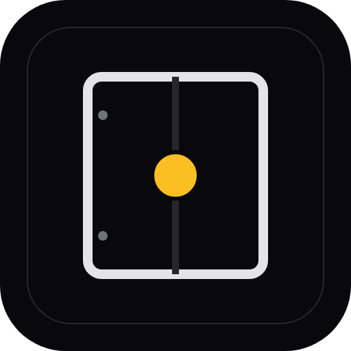
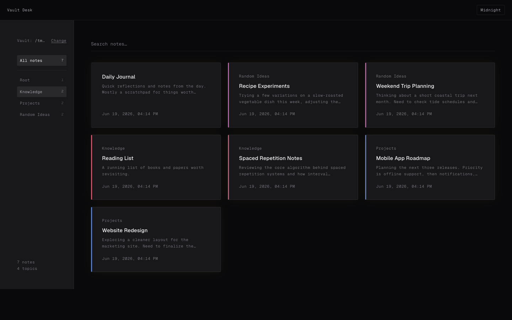
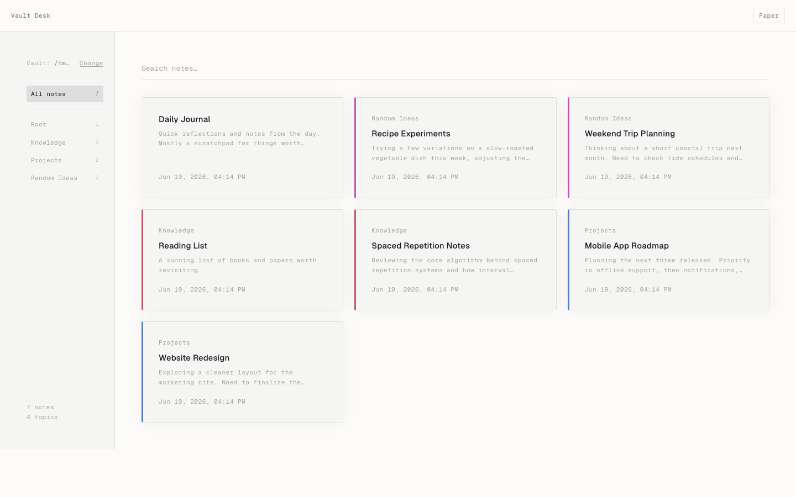
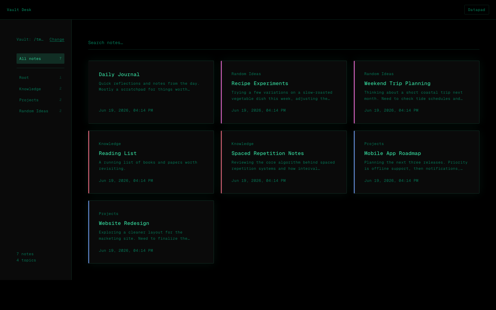
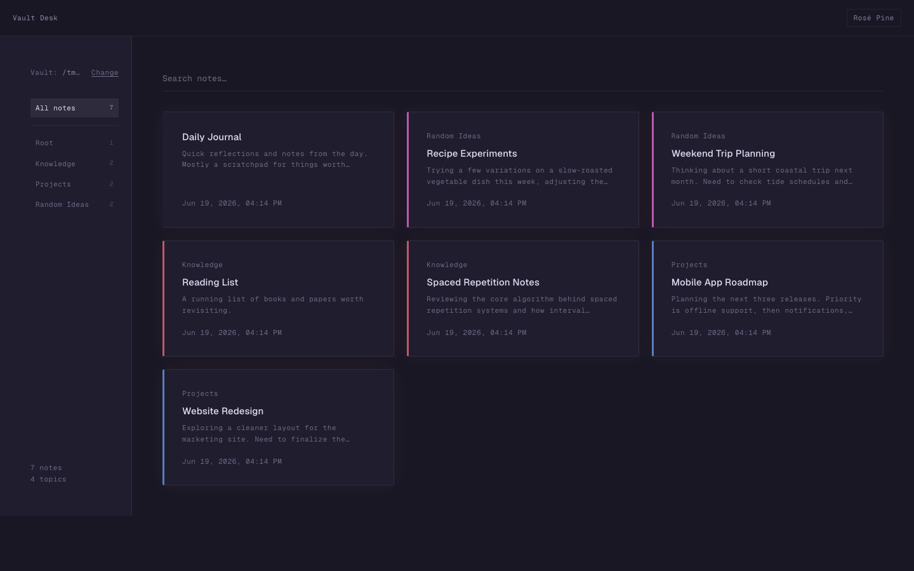
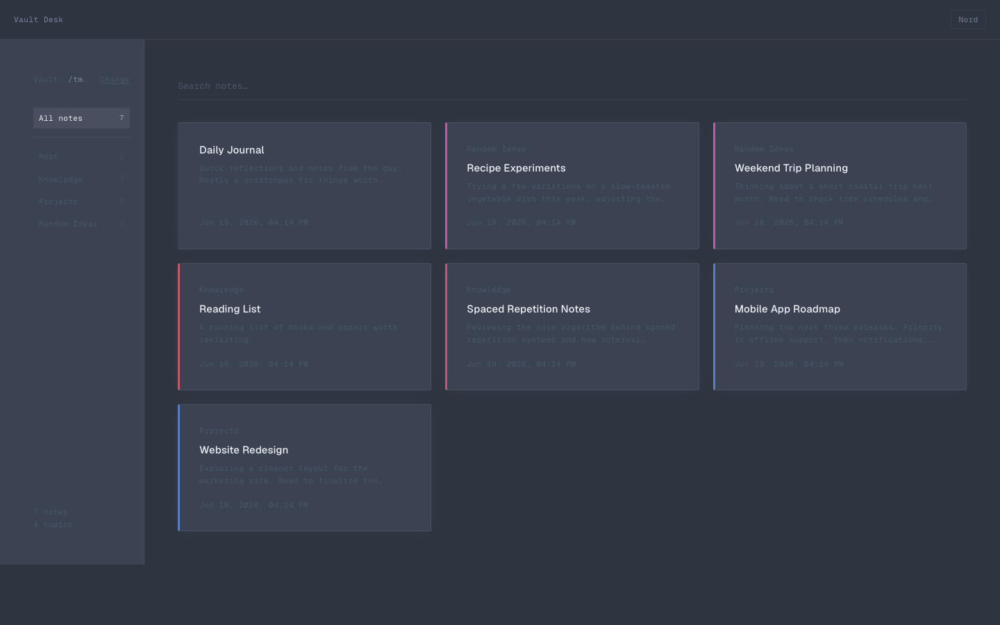
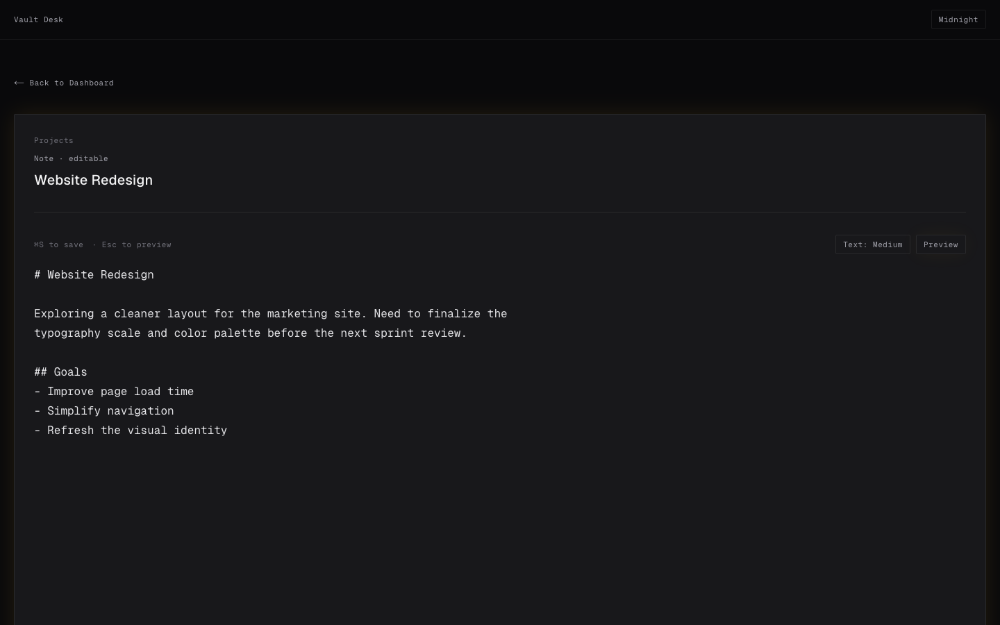

<p align="center">
  
</p>

# Vault Desk

[](https://github.com/Navn33t-gettoit/vault-desk/actions/workflows/ci.yml)
[](LICENSE)

A local-first browser interface for Obsidian Vaults.

Vault Desk runs as a lightweight local server and opens in your browser. Every edit is written directly back to your raw `.md` files in real time. No cloud, no account, no Electron.

**Home address:** [http://127.0.0.1:7423](http://127.0.0.1:7423)

> Built with AI assistance (Gemini for planning, Cursor and Claude for implementation). I'm not a professional developer — I had a problem I wanted to solve for my own Obsidian workflow and used AI tools to build it. Issues and PRs are welcome; response time depends on how well I (with AI help) can understand the change.

<p align="center">
  
</p>

---

### Privacy First

Your vault stays on your machine. Vault Desk reads notes directly from your local filesystem — your notes, filenames, and personal data never leave your device.

---

### Themes

Five built-in themes, cycled from the header button:

* **Midnight** — High-contrast dark workspace.
* **Paper** — Warm, document-inspired reading experience.
* **Datapad** — Monochrome terminal-inspired interface.
* **Rosé Pine** — Muted dusk palette with a warm rose accent.
* **Nord** — Cool arctic blues for long reading sessions.

<p align="center">
  
  
</p>
<p align="center">
  
  
</p>

---

### Features

* **Permanent dashboard** — Runs as a login item; always at [http://127.0.0.1:7423](http://127.0.0.1:7423), no terminal needed.
* **Sidebar navigation** — Topics listed with note counts, scrollable no matter how many folders you have.
* **Search** — Filter notes by title within any topic.
* **Drag to reorder** — Rearrange note cards however you like.
* **Real-time editing** — Changes write back to disk instantly.
* **Live reading metrics** — Word count and reading time in the editor.
* **Three themes** — Switch from the header.

---

### Setup (macOS)

**Requirements:** [Node.js 20+](https://nodejs.org)

#### Option 1 — Double-click

Double-click **`Launch Vault Desk.command`** in the project folder.

This installs Vault Desk as a login item (runs on startup), builds it, and opens [http://127.0.0.1:7423](http://127.0.0.1:7423) in your browser. First run takes ~1 minute to build.

> If macOS blocks it: right-click → **Open** → **Open**.

#### Option 2 — Terminal

```bash
git clone https://github.com/Navn33t-gettoit/vault-desk.git
cd vault-desk
npm install
npm run setup
```

#### After setup

Pin [http://127.0.0.1:7423](http://127.0.0.1:7423) as a tab in your browser. The server starts automatically every time you log in.

To remove the login item:

```bash
npm run uninstall
```

---

### Windows / Linux

```bash
npm install
npm run build
npm start
```

Then open [http://127.0.0.1:7423](http://127.0.0.1:7423). Add `npm start` to your startup items manually.

**Windows:** double-click `Launch Vault Desk.bat` to build and start in one step.

---

### First-time use

1. Open [http://127.0.0.1:7423](http://127.0.0.1:7423).
2. Click **Browse…** (macOS) or type your Obsidian vault path and hit **Scan vault**.
3. Your notes appear grouped by topic in the sidebar.
4. Click a topic to filter, use the search bar to find notes by title, or click any card to open and edit.

The vault path is saved — future launches go straight to your dashboard.

<p align="center">
  
</p>

---

### Changing the port

Edit `app.config.cjs`:

```js
const APP_PORT = 7423; // ← change this
```

Then rebuild and re-run setup:

```bash
npm run build
npm run setup
```

---

### Environment variables

| Variable | Description |
|---|---|
| `VAULT_PATH` | Pre-set the vault path without going through the scan UI. |

---

### npm scripts

| Command | Description |
|---|---|
| `npm run setup` | Install as a login item and open in browser (macOS) |
| `npm run uninstall` | Remove login item and stop server (macOS) |
| `npm run dev` | Development server with hot reload |
| `npm run build` | Production build |
| `npm start` | Start production server |

---

### API

| Endpoint | Method | Description |
|---|---|---|
| `/api/scan` | `POST` | `{ "vaultPath": "/path" }` — scans vault, returns topics and notes |
| `/api/save` | `POST` | `{ "slug", "content" }` — writes markdown back to disk |
