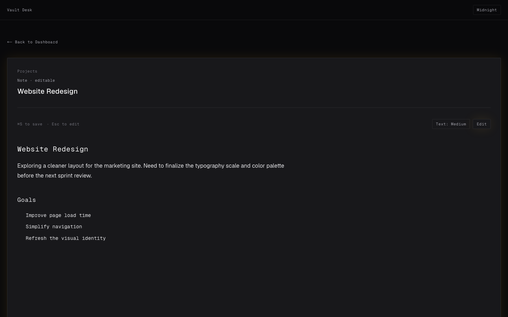

<p align="center">
  
</p>

<h1 align="center">Vault Desk</h1>

<p align="center">
  A local-first reading and editing surface for your Obsidian vault — in the browser, no Electron, no cloud.
</p>

<p align="center">
  <a href="https://github.com/Navn33t-gettoit/vault-desk/actions/workflows/ci.yml">
    
  </a>
  <a href="LICENSE">
    
  </a>
</p>

---

<p align="center">
  
</p>

---

## Why

Obsidian is great for capturing and linking ideas. But sometimes you just want to **read** — browse your notes like a clean dashboard, open one, edit it, and get out. No graph view, no plugins to configure, no app to keep open.

Vault Desk runs as a tiny local server and opens in your browser. It reads your `.md` files directly from disk. Every edit you make writes back to the same file Obsidian uses. Nothing is synced, stored, or sent anywhere.

**Home address:** [http://127.0.0.1:7423](http://127.0.0.1:7423)

> Built with AI assistance (Gemini for planning, Cursor and Claude for implementation). I'm not a professional developer — I built this to scratch my own itch. Issues and PRs welcome.

---

## Privacy

Your vault never leaves your machine. Vault Desk reads files directly from your local filesystem. No accounts, no telemetry, no cloud.

---

## Features

- **Always-on dashboard** — installs as a login item on macOS; always at `127.0.0.1:7423`, no terminal needed after setup
- **Topic sidebar** — folders become topics in the sidebar, with note counts
- **Search** — filter notes by title instantly
- **Drag to reorder** — rearrange cards on the dashboard however you like; order persists
- **Real-time editing** — autosaves 900ms after you stop typing; `⌘S` to save immediately
- **Edit / Preview toggle** — `Esc` to switch between raw Markdown and rendered preview
- **Wikilinks** — `[[Note Name]]` links are rendered and navigable
- **YouTube embeds** — paste a YouTube URL on its own line and it embeds automatically
- **Reading metrics** — live word count and estimated read time in the editor footer
- **Five themes** — cycle through from the header button

---

## Themes

<p align="center">
  
  
</p>
<p align="center">
  
  
</p>
<p align="center">
  
</p>

| Theme | Feel |
|---|---|
| **Midnight** | High-contrast dark workspace |
| **Paper** | Warm, document-inspired reading surface |
| **Datapad** | Monochrome terminal aesthetic |
| **Rosé Pine** | Muted dusk palette with a warm rose accent |
| **Nord** | Cool arctic blues for long reading sessions |

---

## Editor

<p align="center">
  
  
</p>

Edit mode and rendered preview, side by side. Switch with `Esc` or the button in the top-right.

---

## Setup

### macOS

**Requires:** [Node.js 20+](https://nodejs.org)

**Option 1 — Double-click (recommended)**

Double-click **`Launch Vault Desk.command`** in the project folder. It installs the server as a login item, builds, and opens your browser. First run takes ~1 minute.

> If macOS blocks it: right-click → **Open** → **Open**.

**Option 2 — Terminal**

```bash
git clone https://github.com/Navn33t-gettoit/vault-desk.git
cd vault-desk
npm install
npm run setup
```

After setup, pin [http://127.0.0.1:7423](http://127.0.0.1:7423) as a browser tab. The server starts automatically at login.

To uninstall:

```bash
npm run uninstall
```

### Windows / Linux

```bash
git clone https://github.com/Navn33t-gettoit/vault-desk.git
cd vault-desk
npm install
npm run build
npm start
```

Open [http://127.0.0.1:7423](http://127.0.0.1:7423). Add `npm start` to your startup items manually.

**Windows:** double-click `Launch Vault Desk.bat` to build and launch in one step.

---

## First use

1. Open [http://127.0.0.1:7423](http://127.0.0.1:7423)
2. Paste your Obsidian vault path and hit **Scan vault**
3. Your notes appear grouped by folder in the sidebar
4. Click a topic, search by title, or click any card to open and edit

The vault path is saved — future launches go straight to your dashboard.

---

## Updating

After pulling a new version, rebuild and restart in one step:

```bash
npm run rebuild
```

Don't run `npm run build` alone while the server is live — it can cause asset mismatches. `npm run rebuild` handles both.

---

## Configuration

### Changing the port

Edit `app.config.cjs`:

```js
const APP_PORT = 7423; // ← change this
```

Then reinstall the login item to pick up the new port:

```bash
npm run setup
```

### Environment variables

| Variable | Description |
|---|---|
| `VAULT_PATH` | Pre-set the vault path, skipping the scan UI on first launch |

---

## npm scripts

| Command | Description |
|---|---|
| `npm run setup` | Install as a macOS login item and open in browser |
| `npm run rebuild` | Rebuild and restart the running login item (use after any update) |
| `npm run uninstall` | Remove the login item and stop the server |
| `npm run dev` | Development server with hot reload |
| `npm run build` | Production build only |
| `npm start` | Start the production server |

---

## Known limitations

- **Search is title-only** — filters note cards by filename, not by content inside the note
- **Changing the port requires reinstalling the login item** — run `npm run setup` after editing `app.config.cjs`
- **No mobile support** — designed for desktop browsers at `127.0.0.1`

---

## API

| Endpoint | Method | Description |
|---|---|---|
| `/api/scan` | `POST` | `{ "vaultPath": "/path" }` — scans vault, returns topics and notes |
| `/api/save` | `POST` | `{ "slug", "content" }` — writes markdown back to disk |

---

## Contributing

Issues and PRs are welcome. Response time depends on how well I (with AI assistance) can understand the change. Please open an issue before large PRs so we can align on approach.
